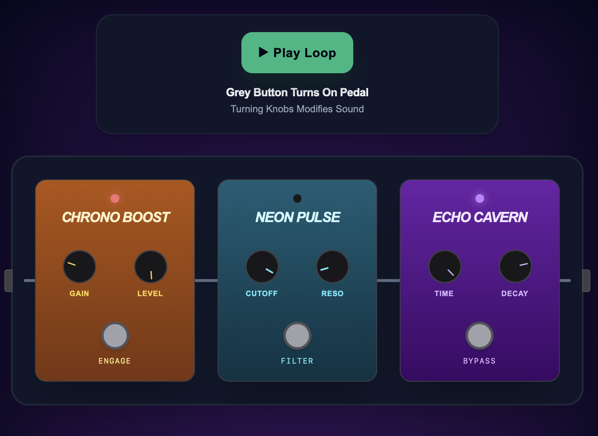
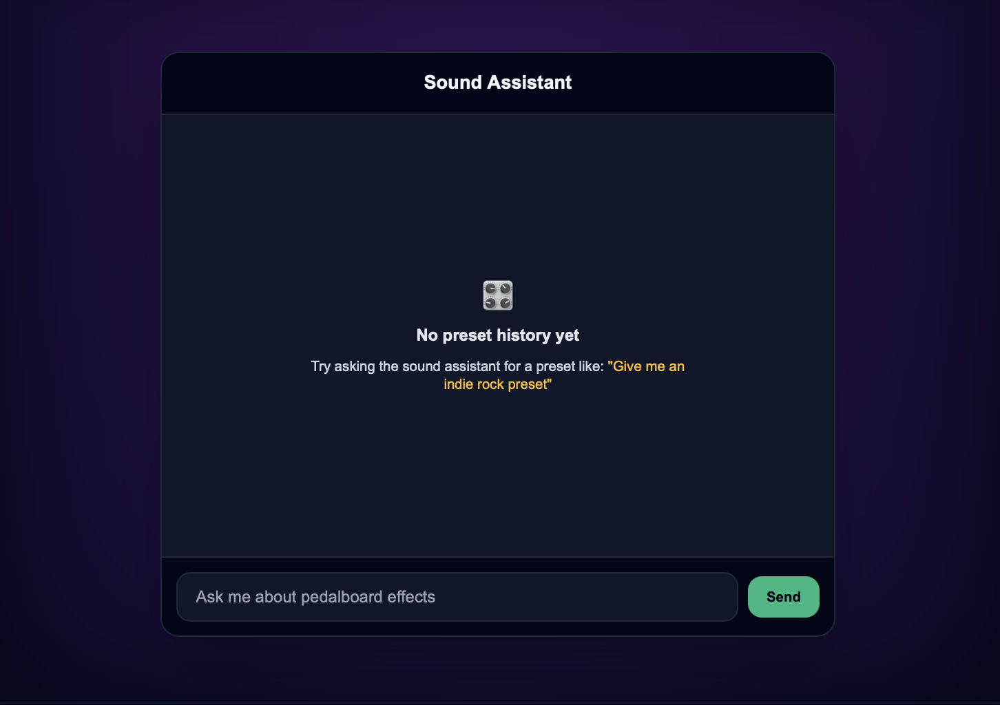

# FlyRank Capstone 

A group of guitar pedals that can manipulate sound loops. This application is optimized using AI-assisted workflows.

## Project Brief
* **What problem does it solve?** Allows guitarists to describe a  sound to configure to a pedalboard.
* **Who is it for?** Guitarists and home-studio musicians.
* **Why did you choose this idea?** To combine frontend web technology with a useful music tool.

## Screenshots
* **Pedalboard & Shader Hero View:** 
* **Pedal Effects Chat Assistant:** 

## Architecture Overview
* **`app/page.tsx`:** Main dashboard coordinating the WebGL/CSS shader background, Web Audio API loop engine, and interactive guitar pedals.
* **`app/api/chat/route.ts`:** Serverless API route handling streaming LLM requests, Zod tool schemas, and production hygiene safeguards.
* **`components/ShaderHero.tsx`:** Dynamic animated background component with built-in accessibility fallbacks (`prefers-reduced-motion`).

## Tech Stack
- **Framework:** Next.js 
- **Styling:** Tailwind CSS
- **Deployment:** Vercel

## Environment Variables (`.env.local`)
| Variable | Description | Required |
| :--- | :--- | :--- |
| `GOOGLE_GENERATIVE_AI_API_KEY` | API key for Gemini LLM-powered preset generation | Yes |

## Setup
```bash
npm install
npm run dev
```

## FE-07 Tool Contract: `suggestPedalPreset`

### Overview
Generates custom audio effects configurations based on a requested user guitar tone or musical genre.

### 1. Tool Name
* `suggestPedalPreset`

### 2. Input Schema (Zod)
* `styleName` (string): The name of the tone or genre (e.g., "Ambient Shoegaze", "Indie Rock").
* `boostEngaged` (boolean): Whether the `Chrono Boost` boost pedal is turned on.
* `gainLevel` (number, min: 0, max: 1): Gain knob value.
* `filterEngaged` (boolean): Whether the `Neon Pulse` pedal is turned on.
* `cutoffFreq` (number, min: 0, max: 1): Cutoff frequency knob value.
* `delayEngaged` (boolean): Whether the `Echo Cavern` pedal is turned on.
* `delayTime` (number, min: 0, max: 1): Delay time knob value.

### 3. Return Shape
```json
{
  "success": true,
  "preset": {
    "styleName": "Indie Rock",
    "boostEngaged": true,
    "gainLevel": 0.6,
    "filterEngaged": true,
    "cutoffFreq": 0.5,
    "delayEngaged": true,
    "delayTime": 0.4
  }
}
```

## FE-AA1 Motion and State Micro-Interactions

* **Durations (150ms):** Button state switches between `Send` and `Stop`. Feedback states use `≈150ms` durations to ensure interface feels snappy.
* **Easing & Compositor Properties:** All state transitions use compositor-friendly properties (transform and opacity) coupled with smooth Framer Motion spring/tween curves.

## FE-AA2: 3D Pedal Experience

* **What was built:** An interactive 3D guitar pedal viewer using pure Three.js to toggle LED lighting.
* **Performance note:** Avoided external `.glb` models and used native WebGL primitives to keep bundle size minimal.
* **With more time:** Add support for custom `.glb` model imports and direct mouse raycasting (users can click the pedal or drag knobs directly inside the canvas).

## Deployment, Error Handling & Rollback
* **Error Handling:** Catches stream failures and connection drops with a one-click "Retry Last Message" fallback flow.
* **Rollback Plan:** Deployment fully automated via Vercel connected. Rollbacks handled instantly via Vercel's dashboard.

## How AI Tools Built This
Accelerate boilerplate generation for Web Audio API node connections, structure Zod schemas for tool-calling contracts, and debug Next.js App Router client/server state boundaries. 

## Reflection
* **What was hardest? Why?** 
  Balancing synchronizing the AI SDK tool-invocation states with UI updates while also keeping the 3D WebGL context stable under Next.js server-side constraints.
* **What would you do differently next time?** 
  Implement end-to-end component testing earlier in the build cycle rather than relying on manual testing toward the end.
* **One thing you learned that surprised you?** 
  How powerful structured tool-calling is for frontend applications. It eliminates parsing errors and makes passing states from a chat prompt to UI components seamless.
