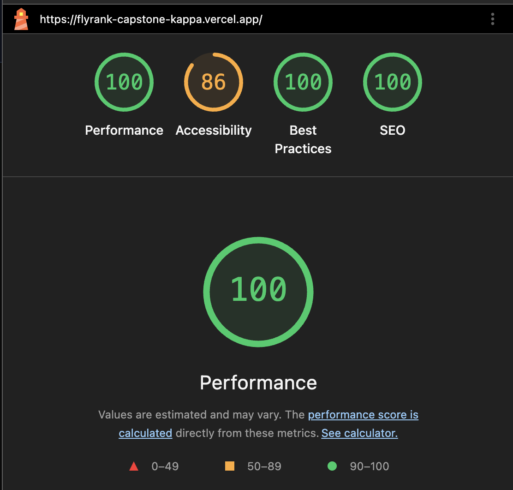

# FlyRank Capstone 

An application optimized using AI-assisted  workflows.

## Tech Stack
- **Framework:** Next.js 
- **Styling:** Tailwind CSS
- **Deployment:** Vercel

## Setup
```bash
npm install
npm run dev
```

## FE-07 Tool Contract: `suggestPedalPreset`

### Overview
Generates custom audio effects configurations based on a requested user guitar tone or musical genre.

### 1. Tool Name
* `suggestPedalPreset`

### 2. Input Schema (Zod)
* `styleName` (string): The name of the tone or genre (e.g., "Ambient Shoegaze", "Indie Rock").
* `boostEngaged` (boolean): Whether the `Chrono Boost` boost pedal is turned on.
* `gainLevel` (number, min: 0, max: 1): Gain knob value.
* `filterEngaged` (boolean): Whether the `Neon Pulse` pedal is turned on.
* `cutoffFreq` (number, min: 0, max: 1): Cutoff frequency knob value.
* `delayEngaged` (boolean): Whether the `Echo Cavern` pedal is turned on.
* `delayTime` (number, min: 0, max: 1): Delay time knob value.

### 3. Return Shape
```json
{
  "success": true,
  "preset": {
    "styleName": "Indie Rock",
    "boostEngaged": true,
    "gainLevel": 0.6,
    "filterEngaged": true,
    "cutoffFreq": 0.5,
    "delayEngaged": true,
    "delayTime": 0.4
  }
}
```

## FE-AA1 Motion and State Micro-Interactions

* **Durations (150ms):** Button state switches between `Send` and `Stop`. Feedback states use `≈150ms` durations to ensure interface feels snappy.
* **Easing & Compositor Properties:** All state transitions use compositor-friendly properties (transform and opacity) coupled with smooth Framer Motion spring/tween curves.

## FE-AA2: 3D Pedal Experience

* **What was built:** An interactive 3D guitar pedal viewer using pure Three.js to toggle LED lighting.
* **Performance note:** Avoided external `.glb` models and used native WebGL primitives to keep bundle size minimal.
* **With more time:** Add support for custom `.glb` model imports and direct mouse raycasting (users can click the pedal or drag knobs directly inside the canvas).

## FE-10: Accessibility and Performance Audit

### 1. Audit Scores
* **Lighthouse Performance:** 100
* **Lighthouse Accessibility:** 86
* **Lighthouse Best Practices:** 100
* **Lighthouse SEO:** 100
* **WAVE Errors:** 0 errors

> 

### 2. Issues Discovered & Fixes Applied
* **Landmarks & Semantics:** Semantic HTML elements (`<main>`, `<nav>`) are structured properly across the application.
* **AI Chat Accessibility:** Integrated `aria-live="polite"` and `aria-relevant="additions"` on Chatboxto ensure screen readers announce incoming assistant tokens. Verified keyboard reachability (`Tab`) and `Enter` key handling for dynamic Send/Stop buttons.
* **Keyboard-Only Navigation Pass:** Verified primary flow (navigating app, interacting with canvas controls, typing and submitting chat queries, toggling stop button) can be completed using only the keyboard.
* **Performance & Asset Loading:** Optimized components, layout shifts, and script delivery to maintain high mobile performance score.
